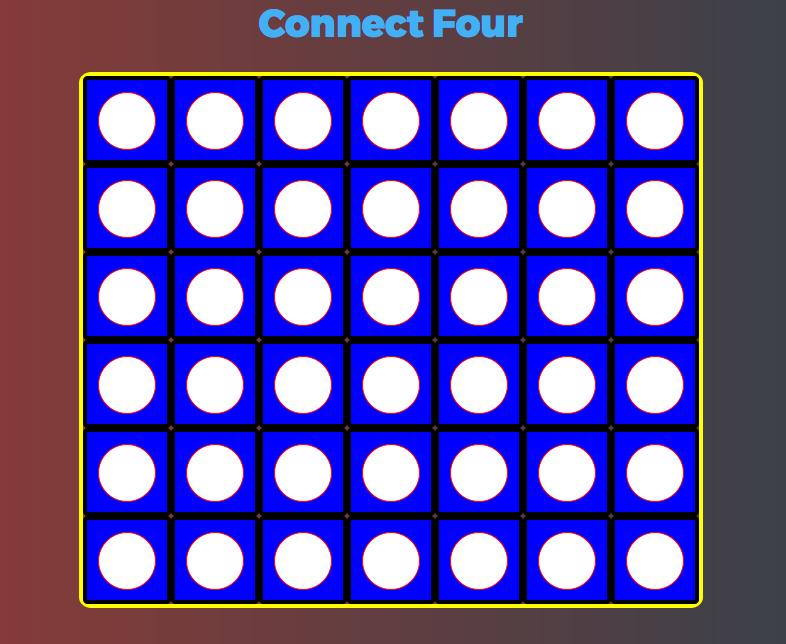

# Connect Four
The classic game of red checkers versus black checkers in a race where each player tries to stack four of their checkers in a row.  A player can win horizontally, vertically, or diagonally.

# A Link to My Game
<https://bkmorgan3.github.io/Connect-Four/>

# How To Play
Drop one checker at a time into an open space on the board.  The goal is to line up 4 of your checkers before your opponent has the chance to do just that.

# Technologies used
I built this game of Connect Four using HTML, CSS, JavaScript, and jQuery.
The code was written in text editor Atom, versioned in Git using Terminal, and kept online at GitHub.com.

# Screenshot

# MVP
-clear winner  
-players alternate turns  
-checkers are different colors and  
-display properly
